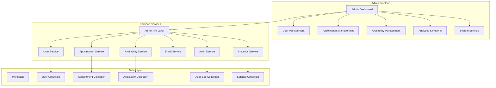

# Admin Panel Enhancements Design Document

## Overview

This design document outlines the comprehensive enhancements to the existing admin panel for Teerthanker Aadinath Bright Dental Care. The enhancements build upon the current React-based admin application with Redux state management, adding advanced administrative capabilities including availability management, booking cancellation with notifications, detailed user views, analytics, and system configuration.

The design leverages the existing technology stack:

- **Frontend**: React 18 with Redux Toolkit, TailwindCSS, Headless UI
- **Backend**: Node.js with Express, MongoDB with Mongoose
- **Email**: Nodemailer with existing email service
- **UI Components**: Existing shared components and accessibility features

## Architecture

### High-Level Architecture



### Component Architecture

The admin panel follows a modular component architecture with clear separation of concerns:

1. **Page Components**: Top-level route components that orchestrate data fetching and layout
2. **Feature Components**: Reusable components for specific functionality (user details, appointment management)
3. **Shared Components**: Common UI components (modals, tables, forms)
4. **Service Layer**: API communication and business logic
5. **State Management**: Redux slices for different feature domains

## Components and Interfaces

### 1. Availability Management System

**Purpose**: Allow admins to manage time slots for appointment booking

**Components**:

- `AvailabilityCalendar`: Visual calendar interface for slot management
- `TimeSlotEditor`: Modal for adding/editing time slots
- `AvailabilitySettings`: Default hours and break time configuration

**API Endpoints**:

```javascript
// Get availability for date range
GET /api/admin/availability?startDate=2024-01-01&endDate=2024-01-31

// Create/Update availability slots
POST /api/admin/availability
PUT /api/admin/availability/:id

// Delete availability slot
DELETE /api/admin/availability/:id

// Get default availability settings
GET /api/admin/availability/settings
PUT /api/admin/availability/settings
```

**Data Model**:

```javascript
const availabilitySchema = {
  date: Date,
  timeSlots: [
    {
      startTime: String, // "09:00"
      endTime: String, // "10:00"
      isAvailable: Boolean,
      maxBookings: Number, // Default 1
    },
  ],
  isHoliday: Boolean,
  notes: String,
  createdBy: ObjectId,
  updatedBy: ObjectId,
};
```

### 2. Enhanced Appointment Management

**Purpose**: Comprehensive appointment management with cancellation capabilities

**Components**:

- `AppointmentTable`: Enhanced table with filtering and actions
- `AppointmentDetails`: Detailed view with patient information
- `CancellationModal`: Interface for appointment cancellation with reason
- `RescheduleModal`: Interface for admin-initiated rescheduling

**Key Features**:

- Real-time status updates
- Bulk operations support
- Advanced filtering (date range, status, patient name)
- Cancellation with email notifications
- Session restoration for cancelled appointments

**API Enhancements**:

```javascript
// Cancel appointment with notification
POST /api/admin/appointments/:id/cancel
{
  reason: String,
  notifyPatient: Boolean,
  restoreSession: Boolean
}

// Bulk operations
POST /api/admin/appointments/bulk-action
{
  appointmentIds: [ObjectId],
  action: 'cancel' | 'confirm' | 'reschedule',
  data: Object
}
```

### 3. Comprehensive User Detail Views

**Purpose**: Tabbed interface for complete patient information management

**Components**:

- `UserDetailTabs`: Main tabbed container
- `PersonalInfoTab`: Editable personal information
- `MedicalInfoTab`: Medical history and conditions
- `PaymentsTab`: Payment history and transactions
- `BookingsTab`: Appointment history with actions
- `SubscriptionTab`: Subscription management interface
- `DocumentsTab`: Document viewer and uploader

**Design Rationale**:

- Tabbed interface reduces cognitive load and improves navigation
- Each tab is lazy-loaded for performance
- Inline editing capabilities for immediate updates
- Consistent validation and error handling across tabs

**State Management**:

```javascript
// Redux slice structure
const userDetailSlice = {
  selectedUser: Object,
  activeTab: String,
  editMode: Object, // Track which sections are being edited
  loading: Object, // Track loading states per tab
  errors: Object, // Track validation errors per tab
};
```

### 4. Email Notification System

**Purpose**: Automated email notifications for booking events

**Enhanced Email Service**:

- Template-based email system
- Queue-based sending for reliability
- Retry mechanism for failed sends
- Admin notification preferences

**New Email Templates**:

1. **New Booking Notification** (to admin)
2. **Appointment Cancellation** (to patient)
3. **Appointment Rescheduled** (to patient)
4. **Subscription Changes** (to patient)

**Implementation**:

```javascript
// Enhanced email service methods
emailService.sendAdminBookingNotification(appointmentData);
emailService.sendCancellationNotification(appointmentData, reason);
emailService.sendRescheduleNotification(oldData, newData);
emailService.sendSubscriptionChangeNotification(userData, changes);
```

### 5. Analytics and Reporting

**Purpose**: Comprehensive analytics dashboard for clinic performance monitoring

**Components**:

- `AnalyticsDashboard`: Main dashboard with key metrics
- `RevenueChart`: Financial performance visualization
- `AppointmentTrends`: Booking patterns and trends
- `PatientGrowth`: User acquisition and retention metrics
- `ReportGenerator`: Customizable report creation

**Key Metrics**:

- Daily/Weekly/Monthly appointment counts
- Revenue trends and projections
- Patient acquisition and retention rates
- Subscription utilization rates
- Cancellation and no-show rates

**Data Aggregation**:

```javascript
// Analytics service methods
analyticsService.getAppointmentMetrics(dateRange, groupBy);
analyticsService.getRevenueMetrics(dateRange);
analyticsService.getPatientMetrics(dateRange);
analyticsService.generateReport(reportType, filters);
```

### 6. System Settings and Configuration

**Purpose**: Centralized configuration management

**Components**:

- `EmailTemplateEditor`: Visual email template customization
- `BusinessRulesConfig`: Booking policies and restrictions
- `TimeSlotDefaults`: Default availability configuration
- `NotificationSettings`: Admin notification preferences

**Configuration Categories**:

1. **Email Settings**: Templates, sender information, notification rules
2. **Booking Rules**: Advance booking limits, cancellation policies
3. **Time Management**: Default slots, break times, holidays
4. **User Interface**: Branding, theme settings

## Data Models

### Enhanced User Model Extensions

```javascript
// Additional fields for comprehensive user management
const userEnhancements = {
  // Audit trail
  lastModified: {
    date: Date,
    by: ObjectId, // Admin user who made changes
    changes: [String], // Array of changed fields
  },

  // Admin notes
  adminNotes: [
    {
      note: String,
      createdBy: ObjectId,
      createdAt: Date,
      isPrivate: Boolean,
    },
  ],

  // Communication preferences
  preferences: {
    emailNotifications: Boolean,
    smsNotifications: Boolean,
    reminderPreference: String, // '24h', '2h', 'none'
  },
};
```

### New Availability Model

```javascript
const availabilitySchema = new mongoose.Schema(
  {
    date: {
      type: Date,
      required: true,
      index: true,
    },
    timeSlots: [
      {
        startTime: {
          type: String,
          required: true,
          match: /^([0-1]?[0-9]|2[0-3]):[0-5][0-9]$/,
        },
        endTime: {
          type: String,
          required: true,
          match: /^([0-1]?[0-9]|2[0-3]):[0-5][0-9]$/,
        },
        isAvailable: {
          type: Boolean,
          default: true,
        },
        maxBookings: {
          type: Number,
          default: 1,
        },
      },
    ],
    isHoliday: {
      type: Boolean,
      default: false,
    },
    notes: String,
    createdBy: {
      type: mongoose.Schema.Types.ObjectId,
      ref: "Admin",
      required: true,
    },
    updatedBy: {
      type: mongoose.Schema.Types.ObjectId,
      ref: "Admin",
    },
  },
  {
    timestamps: true,
  }
);
```

### Audit Log Model

```javascript
const auditLogSchema = new mongoose.Schema(
  {
    adminId: {
      type: mongoose.Schema.Types.ObjectId,
      ref: "Admin",
      required: true,
    },
    action: {
      type: String,
      required: true,
      enum: ["create", "update", "delete", "view", "cancel", "reschedule"],
    },
    resource: {
      type: String,
      required: true,
      enum: ["user", "appointment", "availability", "subscription", "settings"],
    },
    resourceId: {
      type: mongoose.Schema.Types.ObjectId,
      required: true,
    },
    changes: {
      before: mongoose.Schema.Types.Mixed,
      after: mongoose.Schema.Types.Mixed,
    },
    metadata: {
      ipAddress: String,
      userAgent: String,
      sessionId: String,
    },
  },
  {
    timestamps: true,
  }
);
```

## Error Handling

### Frontend Error Handling Strategy

1. **Global Error Boundary**: Catches and displays user-friendly error messages
2. **API Error Interceptors**: Standardized error response handling
3. **Form Validation**: Real-time validation with clear error messages
4. **Optimistic Updates**: UI updates immediately with rollback on failure

### Backend Error Handling

1. **Centralized Error Middleware**: Consistent error response format
2. **Validation Errors**: Detailed field-level error messages
3. **Business Logic Errors**: Domain-specific error handling
4. **External Service Failures**: Graceful degradation for email/SMS failures

**Error Response Format**:

```javascript
{
  success: false,
  error: {
    code: 'VALIDATION_ERROR',
    message: 'User-friendly error message',
    details: {
      field: 'Specific field error'
    }
  },
  timestamp: '2024-01-01T00:00:00Z',
  requestId: 'uuid'
}
```

## Testing Strategy

### Frontend Testing

1. **Unit Tests**: Component logic and utility functions
2. **Integration Tests**: Component interactions and API calls
3. **E2E Tests**: Critical user workflows
4. **Accessibility Tests**: WCAG compliance verification

**Testing Tools**:

- Vitest for unit and integration tests
- Testing Library for component testing
- MSW for API mocking
- Axe for accessibility testing

### Backend Testing

1. **Unit Tests**: Service layer and utility functions
2. **Integration Tests**: API endpoints and database operations
3. **Contract Tests**: API response validation
4. **Performance Tests**: Load testing for critical endpoints

**Testing Coverage Targets**:

- Unit Tests: 90%+ coverage
- Integration Tests: All API endpoints
- E2E Tests: Critical user journeys

### Test Data Management

1. **Database Seeding**: Consistent test data setup
2. **Factory Pattern**: Reusable test data generators
3. **Cleanup Strategy**: Automated test data cleanup
4. **Mock Services**: External service mocking

## Security Considerations

### Authentication and Authorization

1. **Role-Based Access Control**: Admin-specific permissions
2. **Session Management**: Secure session handling with timeout
3. **API Security**: JWT token validation and refresh
4. **Audit Logging**: All admin actions logged for compliance

### Data Protection

1. **Input Validation**: Comprehensive server-side validation
2. **SQL Injection Prevention**: Parameterized queries and ORM usage
3. **XSS Protection**: Content sanitization and CSP headers
4. **CSRF Protection**: Token-based CSRF prevention

### Privacy Compliance

1. **Data Minimization**: Only collect necessary patient data
2. **Access Logging**: Track who accesses patient information
3. **Data Retention**: Automated cleanup of old audit logs
4. **Encryption**: Sensitive data encryption at rest and in transit

## Performance Optimization

### Frontend Performance

1. **Code Splitting**: Route-based and component-based splitting
2. **Lazy Loading**: Deferred loading of non-critical components
3. **Memoization**: React.memo and useMemo for expensive operations
4. **Virtual Scrolling**: For large data tables

### Backend Performance

1. **Database Indexing**: Optimized indexes for common queries
2. **Query Optimization**: Efficient aggregation pipelines
3. **Caching Strategy**: Redis caching for frequently accessed data
4. **Connection Pooling**: Optimized database connections

### Monitoring and Metrics

1. **Performance Monitoring**: Real-time performance tracking
2. **Error Tracking**: Automated error reporting and alerting
3. **Usage Analytics**: Admin feature usage tracking
4. **Health Checks**: Automated system health monitoring

## Deployment and Scalability

### Deployment Strategy

1. **Environment Separation**: Development, staging, and production environments
2. **CI/CD Pipeline**: Automated testing and deployment
3. **Database Migrations**: Version-controlled schema changes
4. **Feature Flags**: Gradual feature rollout capability

### Scalability Considerations

1. **Horizontal Scaling**: Load balancer support for multiple instances
2. **Database Scaling**: Read replicas for analytics queries
3. **Caching Layer**: Distributed caching for session data
4. **CDN Integration**: Static asset optimization

This design provides a comprehensive foundation for implementing all the requirements while maintaining consistency with the existing system architecture and ensuring scalability, security, and maintainability.

