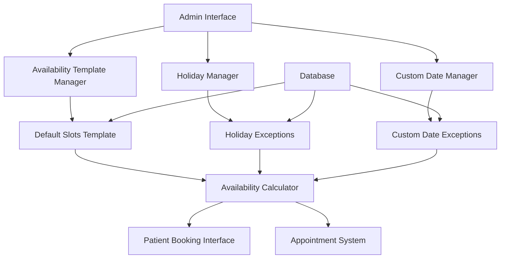

# Design Document

## Overview

The simplified availability system redesigns the current complex availability management approach to use a template-based system with exceptions. Instead of storing individual availability records for each date, the system will use:

1. **Default Template**: A set of time slots (8 AM to 6 PM hourly slots) that apply to all working days
2. **Holiday Exceptions**: Specific dates marked as holidays with no availability
3. **Custom Date Exceptions**: Specific dates with custom slot configurations that override the default template

This approach significantly reduces database storage requirements and improves performance by generating availability dynamically rather than pre-storing it.
 6
## Architecture

### Current System Issues

- Stores individual availability records for each date
- Complex generation and synchronization processes
- High database storage requirements
- Performance issues with large date ranges

### New System Benefits

- Template-based approach with minimal storage
- Dynamic slot generation
- Efficient exception handling
- Simplified management interface
- Better performance and scalability

### System Components



## Components and Interfaces

### 1. Database Schema Changes

#### New AvailabilityTemplate Model

```javascript
const availabilityTemplateSchema = {
  _id: "availability_template", // Singleton document
  defaultSlots: [
    {
      startTime: String, // "08:00"
      endTime: String, // "09:00"
      isActive: Boolean,
      maxBookings: Number,
    },
  ],
  workingDays: [Number], // [1,2,3,4,5,6] (Monday-Saturday)
  slotDuration: Number, // 60 minutes
  updatedBy: ObjectId,
  updatedAt: Date,
};
```

#### Holiday Model (Enhanced)

```javascript
const holidaySchema = {
  date: Date,
  name: String,
  description: String,
  isRecurring: Boolean,
  isActive: Boolean,
  createdBy: ObjectId,
  createdAt: Date,
};
```

#### CustomDateAvailability Model (New)

```javascript
const customDateAvailabilitySchema = {
  date: Date,
  customSlots: [
    {
      startTime: String,
      endTime: String,
      isActive: Boolean,
      maxBookings: Number,
    },
  ],
  reason: String, // "Extended hours", "Reduced availability"
  createdBy: ObjectId,
  createdAt: Date,
  updatedBy: ObjectId,
  updatedAt: Date,
};
```

### 2. API Endpoints

#### Template Management

- `GET /api/admin/availability/template` - Get default template
- `PUT /api/admin/availability/template` - Update default template
- `POST /api/admin/availability/template/slots` - Add custom slot to template
- `DELETE /api/admin/availability/template/slots/:slotId` - Remove slot from template

#### Holiday Management

- `GET /api/admin/availability/holidays` - Get all holidays
- `POST /api/admin/availability/holidays` - Add holiday
- `PUT /api/admin/availability/holidays/:id` - Update holiday
- `DELETE /api/admin/availability/holidays/:id` - Remove holiday
- `POST /api/admin/availability/holidays/bulk` - Bulk add holidays

#### Custom Date Management

- `GET /api/admin/availability/custom-dates` - Get custom date overrides
- `POST /api/admin/availability/custom-dates` - Add custom date
- `PUT /api/admin/availability/custom-dates/:id` - Update custom date
- `DELETE /api/admin/availability/custom-dates/:id` - Remove custom date
- `POST /api/admin/availability/custom-dates/bulk` - Bulk add custom dates

#### Public Availability

- `GET /api/appointments/available-slots/:date` - Get available slots for date (uses new calculation)
- `GET /api/appointments/available-dates` - Get available dates in range

### 3. Frontend Components

#### SlotTemplateManager Component

```jsx
const SlotTemplateManager = () => {
  // Visual grid of time slots (8 AM - 6 PM)
  // Click to toggle slot active/inactive
  // Add custom slot functionality
  // Save template changes
};
```

#### HolidayManager Component

```jsx
const HolidayManager = () => {
  // Calendar interface for selecting holiday dates
  // Holiday list with edit/delete options
  // Bulk holiday import
  // Recurring holiday setup
};
```

#### CustomDateManager Component

```jsx
const CustomDateManager = () => {
  // Date picker for selecting custom dates
  // Slot editor for custom date slots
  // List of existing custom dates
  // Preview of how custom date will appear
};
```

#### AvailabilityPreview Component

```jsx
const AvailabilityPreview = () => {
  // Calendar view showing how availability appears to patients
  // Different colors for default, custom, and holiday dates
  // Slot details on hover/click
};
```

### 4. Backend Services

#### AvailabilityCalculator Service

```javascript
class AvailabilityCalculator {
  // Calculate available slots for a specific date
  async getAvailableSlotsForDate(date) {
    // 1. Check if date is holiday -> return empty
    // 2. Check if date has custom slots -> return custom
    // 3. Check if date is working day -> return template slots
    // 4. Filter out booked slots
  }

  // Calculate available dates in range
  async getAvailableDatesInRange(startDate, endDate) {
    // Generate dates excluding holidays
    // Include only working days or custom dates
  }

  // Validate slot booking
  async validateSlotBooking(date, time) {
    // Check if slot exists and is available
    // Check business rules
    // Return validation result
  }
}
```

#### TemplateManager Service

```javascript
class TemplateManager {
  // Get current template
  async getTemplate() {}

  // Update template slots
  async updateTemplate(slots, userId) {}

  // Add custom slot to template
  async addCustomSlot(slotData, userId) {}

  // Remove slot from template
  async removeSlot(slotId, userId) {}

  // Generate default template
  async generateDefaultTemplate() {
    // Create 8 AM - 6 PM hourly slots
  }
}
```

## Data Models

### Template-Based Availability Calculation

```javascript
// Pseudo-code for availability calculation
function calculateAvailabilityForDate(date) {
  // Step 1: Check if holiday
  if (isHoliday(date)) {
    return { slots: [], isHoliday: true, reason: getHolidayName(date) };
  }

  // Step 2: Check for custom date override
  const customDate = getCustomDateOverride(date);
  if (customDate) {
    return {
      slots: customDate.customSlots,
      isCustom: true,
      reason: customDate.reason,
    };
  }

  // Step 3: Check if working day
  const dayOfWeek = date.getDay();
  if (!isWorkingDay(dayOfWeek)) {
    return { slots: [], isWorkingDay: false };
  }

  // Step 4: Return template slots
  const template = getAvailabilityTemplate();
  return {
    slots: template.defaultSlots.filter((slot) => slot.isActive),
    isDefault: true,
  };
}
```

### Slot Data Structure

```javascript
const slotStructure = {
  startTime: "09:00",
  endTime: "10:00",
  isActive: true,
  maxBookings: 1,
  currentBookings: 0, // Calculated dynamically
  isAvailable: true, // Calculated based on bookings
  source: "template" | "custom" | "holiday",
};
```

## Error Handling

### Template Management Errors

- **Overlapping Slots**: Prevent creation of overlapping time slots
- **Invalid Time Format**: Validate HH:MM format
- **Minimum Duration**: Ensure slots are at least 15 minutes
- **Maximum Duration**: Limit slots to reasonable duration (4 hours)

### Holiday Management Errors

- **Duplicate Holidays**: Prevent duplicate holidays on same date
- **Past Date Holidays**: Allow but warn when adding holidays for past dates
- **Invalid Date Format**: Validate date inputs

### Custom Date Errors

- **Conflicting Dates**: Handle conflicts between holidays and custom dates
- **Invalid Slot Configuration**: Validate custom slot configurations
- **Past Date Modifications**: Restrict modifications to past dates with existing appointments

### Booking Validation Errors

- **Slot Not Available**: Handle cases where calculated slot doesn't exist
- **Booking Conflicts**: Prevent double-booking
- **Business Rule Violations**: Enforce advance booking limits, same-day restrictions

## Testing Strategy

### Unit Tests

1. **AvailabilityCalculator Tests**

   - Test slot calculation for different date types
   - Test holiday detection
   - Test custom date override logic
   - Test working day validation

2. **TemplateManager Tests**

   - Test template CRUD operations
   - Test slot validation
   - Test default template generation

3. **Model Validation Tests**
   - Test schema validations
   - Test business rule enforcement
   - Test data integrity constraints

### Integration Tests

1. **API Endpoint Tests**

   - Test all availability management endpoints
   - Test error handling and validation
   - Test authentication and authorization

2. **Database Integration Tests**
   - Test template storage and retrieval
   - Test holiday and custom date operations
   - Test data consistency

### End-to-End Tests

1. **Admin Workflow Tests**

   - Test complete slot management workflow
   - Test holiday management workflow
   - Test custom date management workflow

2. **Patient Booking Tests**
   - Test availability display for patients
   - Test booking against different slot types
   - Test booking validation

### Performance Tests

1. **Availability Calculation Performance**

   - Test calculation speed for large date ranges
   - Test memory usage with many custom dates
   - Compare performance with old system

2. **Database Query Performance**
   - Test query performance for availability calculation
   - Test indexing effectiveness
   - Monitor query execution times

## Migration Strategy

### Phase 1: New System Implementation

1. Create new models and database collections
2. Implement new API endpoints
3. Build new admin interface components
4. Implement availability calculation service

### Phase 2: Data Migration

1. Analyze existing availability data
2. Extract default patterns to create template
3. Identify holidays and create holiday records
4. Identify custom dates and create custom date records
5. Validate migrated data accuracy

### Phase 3: System Cutover

1. Deploy new system alongside old system
2. Run parallel testing
3. Gradually migrate admin users to new interface
4. Update patient booking interface to use new calculation
5. Decommission old availability system

### Phase 4: Cleanup

1. Remove old availability models and endpoints
2. Clean up unused database collections
3. Update documentation
4. Monitor system performance and optimize

## Security Considerations

### Access Control

- Only admin users can modify templates, holidays, and custom dates
- Audit logging for all availability management actions
- Role-based permissions for different admin functions

### Data Validation

- Server-side validation for all time formats and date ranges
- Prevention of malicious data injection
- Validation of business rule compliance

### API Security

- Rate limiting on availability calculation endpoints
- Input sanitization for all user inputs
- Proper error handling without information leakage

## Performance Optimizations

### Caching Strategy

- Cache availability template in memory
- Cache holiday list with TTL
- Cache custom date overrides
- Implement cache invalidation on updates

### Database Indexing

- Index holiday dates for fast lookup
- Index custom date dates for fast lookup
- Compound indexes for date range queries

### Query Optimization

- Minimize database queries for availability calculation
- Use aggregation pipelines for complex queries
- Implement query result caching

## Monitoring and Analytics

### System Metrics

- Availability calculation response times
- Template modification frequency
- Holiday and custom date usage patterns
- Error rates and types

### Business Metrics

- Slot utilization rates
- Popular time slots
- Holiday impact on bookings
- Custom date usage effectiveness

### Alerting

- Alert on availability calculation failures
- Alert on unusual template modification patterns
- Alert on performance degradation
- Alert on data inconsistencies
